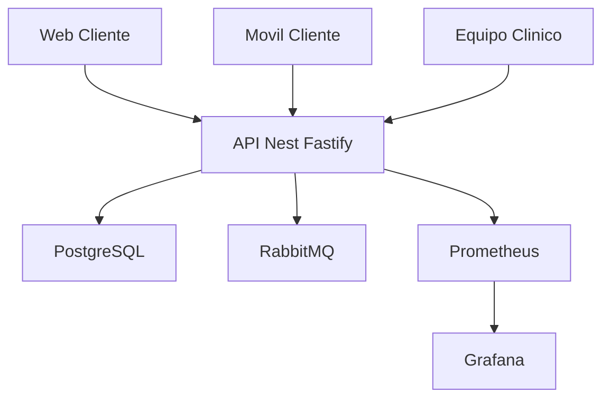
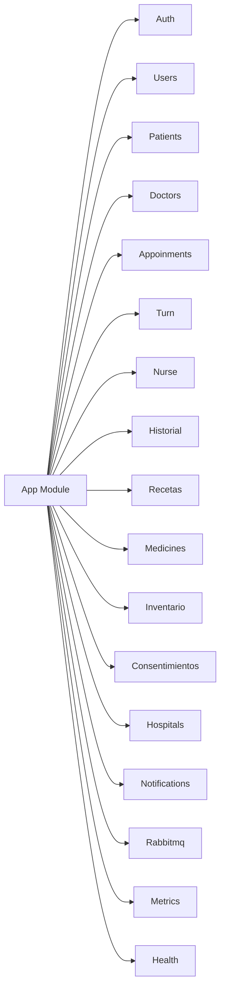
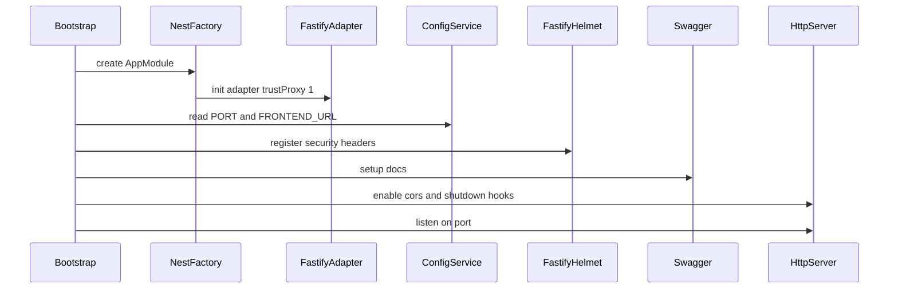
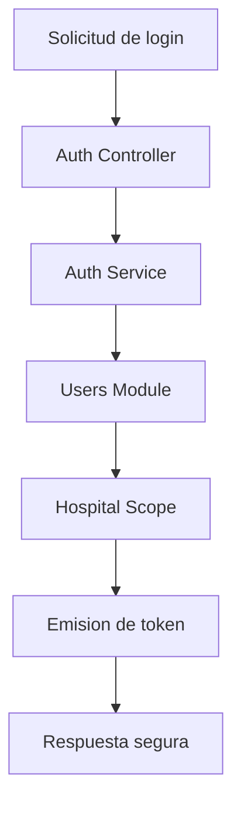
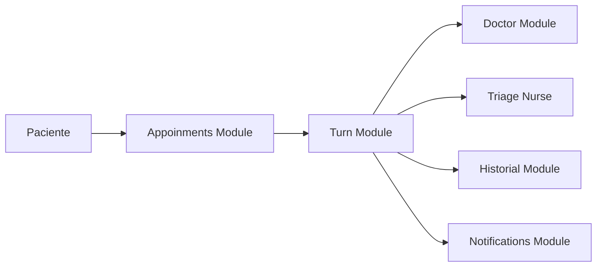
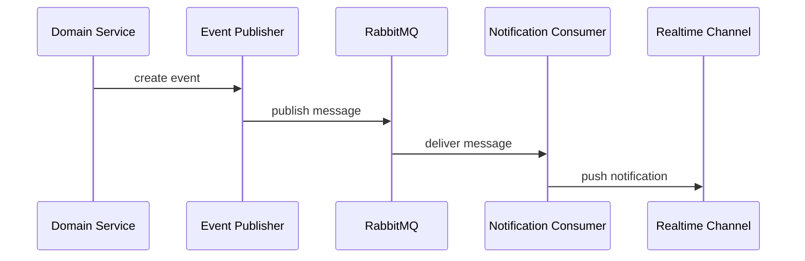
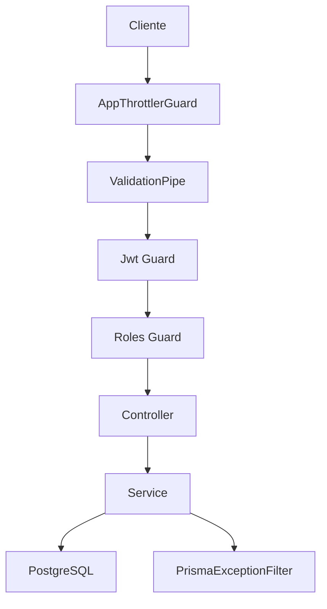
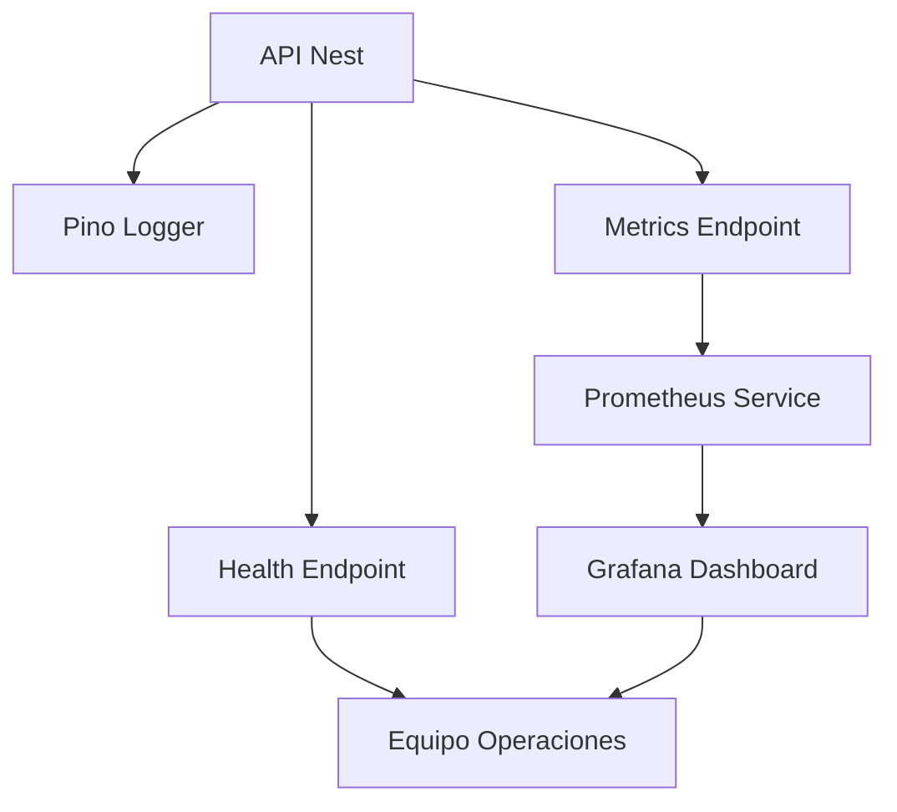

<p align="center">
  <a href="http://nestjs.com/" target="blank"></a>
</p>

[circleci-image]: https://img.shields.io/circleci/build/github/nestjs/nest/master?token=abc123def456
[circleci-url]: https://circleci.com/gh/nestjs/nest

  <p align="center">A progressive <a href="http://nodejs.org" target="_blank">Node.js</a> framework for building efficient and scalable server-side applications.</p>
    <p align="center">
<a href="https://www.npmjs.com/~nestjscore" target="_blank"></a>
<a href="https://www.npmjs.com/~nestjscore" target="_blank"></a>
<a href="https://www.npmjs.com/~nestjscore" target="_blank"></a>
<a href="https://circleci.com/gh/nestjs/nest" target="_blank"></a>
<a href="https://discord.gg/G7Qnnhy" target="_blank"></a>
<a href="https://opencollective.com/nest#backer" target="_blank"></a>
<a href="https://opencollective.com/nest#sponsor" target="_blank"></a>
  <a href="https://paypal.me/kamilmysliwiec" target="_blank"></a>
    <a href="https://opencollective.com/nest#sponsor"  target="_blank"></a>
  <a href="https://twitter.com/nestframework" target="_blank"></a>
</p>
  <!--[](https://opencollective.com/nest#backer)
  [](https://opencollective.com/nest#sponsor)-->

## Description

[Nest](https://github.com/nestjs/nest) framework TypeScript starter repository.

## Asclepio API en 60 segundos

Asclepio es una API hospitalaria de alto impacto construida con NestJS, diseñada para operar flujos reales de clínicas y hospitales: autenticación por roles, gestión multi-hospital, turnos en tiempo real, pacientes, médicos, enfermería, inventario, recetas, historial clínico y notificaciones.

Este backend combina **REST + GraphQL + Subscriptions + mensajería asíncrona**, con foco en seguridad, escalabilidad y observabilidad. Es la base ideal para una plataforma de salud moderna, trazable y lista para crecer.

## Características principales

- Arquitectura modular por dominio: auth, users, patients, doctors, appoinments, triage, turn, inventario, medicines, historial, recetas, notifications.
- API híbrida: endpoints REST documentados en Swagger y operaciones GraphQL con schema auto-generado; en desarrollo se persiste en `src/schema.gql` para tooling y documentación.
- Tiempo real con GraphQL Subscriptions (`graphql-ws`) para eventos clínicos y de turnos.
- Seguridad robusta: JWT por hospital, `helmet`, validación global, `throttling` por tipo de tráfico y filtros de errores.
- Integración con RabbitMQ para notificaciones/eventos desacoplados y resilientes.
- Observabilidad completa: métricas Prometheus (`/metrics`), health checks (`/health`) y tableros Grafana.
- Logging estructurado con `pino`, optimizado para desarrollo y producción.
- Persistencia con PostgreSQL + Prisma, incluyendo soporte para cifrado de campos sensibles.

## Puntos fuertes

- Producto listo para entorno real de salud: prioriza aislamiento por hospital, trazabilidad y protección de datos.
- Excelente experiencia de desarrollo: documentación viva (`/docs`), schema GraphQL generado y módulos consistentes.
- Escalable desde MVP hasta operación enterprise: separación por contextos de negocio y telemetría lista desde el día uno.
- Preparado para equipos multidisciplinarios: frontend, backend y analítica pueden trabajar en paralelo sin fricción.

## Diagramas Asclepio M1 en Mermaid

### Diagrama 1 Contexto de plataforma



### Diagrama 2 Mapa modular de dominio



### Diagrama 3 Arranque de la aplicacion



### Diagrama 4 Flujo de autenticacion JWT



### Diagrama 5 Flujo de citas y turnos



### Diagrama 6 Eventos asincronos con RabbitMQ



### Diagrama 7 Cadena de seguridad y control



### Diagrama 8 Observabilidad operacional



## Inicio rápido (Local)

### 1) Prerrequisitos

- Node.js 20+ (recomendado)
- pnpm
- PostgreSQL disponible local/remoto
- RabbitMQ (opcional para flujos de notificaciones)

### 2) Instalar dependencias

```bash
pnpm install
```

### 3) Configurar entorno

```bash
cp .env.example .env
```

Configura al menos estas variables en `.env`:

- `DATABASE_URL` (PostgreSQL)
- `JWT_SECRET` (min. 32 caracteres)
- `PORT` (por defecto `3000`)
- `FRONTEND_URL` (por defecto `http://localhost:5173`)
- `RABBITMQ_URL` (opcional, fallback `amqp://localhost:5672`)
- `FIELD_ENCRYPTION_KEY` / `FIELD_ENCRYPTION_SALT` (recomendado para datos sensibles)

### 4) Preparar Prisma

```bash
pnpm exec prisma generate
pnpm exec prisma db push
```

### 5) Levantar API en desarrollo

```bash
pnpm run start:dev
```

En desarrollo, Nest actualiza automáticamente `src/schema.gql` cuando cambia el schema GraphQL. En producción, el schema se mantiene en memoria y no se reescribe ese archivo.

## Endpoints y accesos útiles

- Swagger REST: `http://localhost:3000/docs`
- GraphQL: `http://localhost:3000/graphql`
- Health checks: `http://localhost:3000/health` y `http://localhost:3000/health/liveness`
- Prometheus metrics: `http://localhost:3000/metrics`

## Observabilidad con Docker (Prometheus + Grafana)

Para levantar monitoreo local:

```bash
docker compose up -d
```

Servicios disponibles:

- Prometheus: `http://localhost:9090`
- Grafana: `http://localhost:4000` (usuario: `admin`, clave: `admin`)

## ¿Por qué Asclepio destaca?

Porque no es solo un backend CRUD: es una plataforma clínica preparada para operación real. Integra seguridad, tiempo real, mensajería, métricas y modularidad en un solo núcleo técnico. Si buscas una base sólida para construir el próximo gran ecosistema digital en salud, Asclepio ya viene con gran parte del trabajo crítico resuelto.

## Project setup

```bash
$ pnpm install
```

## Compile and run the project

```bash
# development
$ pnpm run start

# watch mode
$ pnpm run start:dev

# production mode
$ pnpm run start:prod
```

## Run tests

```bash
# unit tests
$ pnpm run test

# e2e tests
$ pnpm run test:e2e

# test coverage
$ pnpm run test:cov
```

## Deployment

When you're ready to deploy your NestJS application to production, there are some key steps you can take to ensure it runs as efficiently as possible. Check out the [deployment documentation](https://docs.nestjs.com/deployment) for more information.

If you are looking for a cloud-based platform to deploy your NestJS application, check out [Mau](https://mau.nestjs.com), our official platform for deploying NestJS applications on AWS. Mau makes deployment straightforward and fast, requiring just a few simple steps:

```bash
$ pnpm install -g @nestjs/mau
$ mau deploy
```

With Mau, you can deploy your application in just a few clicks, allowing you to focus on building features rather than managing infrastructure.

## Resources

Check out a few resources that may come in handy when working with NestJS:

- Visit the [NestJS Documentation](https://docs.nestjs.com) to learn more about the framework.
- For questions and support, please visit our [Discord channel](https://discord.gg/G7Qnnhy).
- To dive deeper and get more hands-on experience, check out our official video [courses](https://courses.nestjs.com/).
- Deploy your application to AWS with the help of [NestJS Mau](https://mau.nestjs.com) in just a few clicks.
- Visualize your application graph and interact with the NestJS application in real-time using [NestJS Devtools](https://devtools.nestjs.com).
- Need help with your project (part-time to full-time)? Check out our official [enterprise support](https://enterprise.nestjs.com).
- To stay in the loop and get updates, follow us on [X](https://x.com/nestframework) and [LinkedIn](https://linkedin.com/company/nestjs).
- Looking for a job, or have a job to offer? Check out our official [Jobs board](https://jobs.nestjs.com).

## Support

Nest is an MIT-licensed open source project. It can grow thanks to the sponsors and support by the amazing backers. If you'd like to join them, please [read more here](https://docs.nestjs.com/support).

## Stay in touch

- Author - [Kamil Myśliwiec](https://twitter.com/kammysliwiec)La diferencia fundamental radica 
- Website - [https://nestjs.com](https://nestjs.com/)
- Twitter - [@nestframework](https://twitter.com/nestframework)

## License

Nest is [MIT licensed](https://github.com/nestjs/nest/blob/master/LICENSE).
